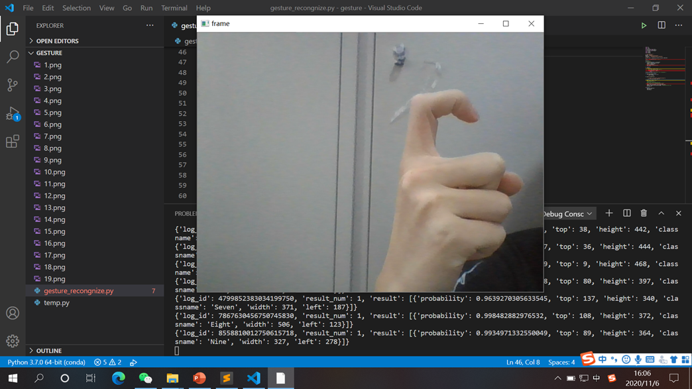

# 实验报告
王硕     2018202100

# 2020.10.30

## 项目概论
我们小组对于无人机项目的进度目前可大致分为三个阶段：<br>
1. 使用Python程序完成对无人机的基本操控
2. 结合语音识别技术
3. 结合图像识别技术

## 阶段一  Python操纵无人机

我们最初的想法是使用Tello的原生接口实现对无人机的操纵，其中需要使用socket向无人机发送指令，如：
```python
#连接tello
tello_address = ('192.168.10.1', 8889)

#本地计算机的Ip和端口
local_address = ('', 9000)
#local_address = ('192.168.10.2', 139)

#创建一个UDP连接用于发送命令
sock = socket.socket(socket.AF_INET,socket.SOCK_DGRAM)

# 绑定到本地地址和端口
sock.bind(local_address)
```
但是由于Windows系统与Tello系统的网络编程兼容性不好，因此这种连接不太稳定，且网络编程底层技术并不是本项目的重点，为了使这一部分变得简洁且有效，我们最终使用了tellopy这一Python的库，实现对无人机的高效操控，以下为tellopy的类与部分方法：
```python
    class Tello(builtins.object)
     |  Tello(port=9000)
     |
     |  Methods defined here:
     |
     |  __init__(self, port=9000)
     |      Initialize self.  See help(type(self)) for accurate signature.
     |
     |  backward(self, val)
     |      Backward tells the drone to go in reverse. Pass in an int from 0-100.
     |
     |  clockwise(self, val)
     |      Clockwise tells the drone to rotate in a clockwise direction.
     |      Pass in an int from 0-100.
     |
     |  connect(self)
     |      Connect is used to send the initial connection request to the drone.
     |
     |  counter_clockwise(self, val)
     |      CounterClockwise tells the drone to rotate in a counter-clockwise direction.
     |      Pass in an int from 0-100.
     |
     |  down(self, val)
     |      Down tells the drone to descend. Pass in an int from 0-100.
     |
     |  flip_back(self)
     |      flip_back tells the drone to perform a backwards flip
     |
     |  flip_backleft(self)
     |      flip_backleft tells the drone to perform a backwards left flip
     |
     |  flip_backright(self)
     |      flip_backleft tells the drone to perform a backwards right flip
     |
     |  flip_forward(self)
     .......
```
## 阶段二 无人机与语音识别的结合
这一部分我们主要借助计算机接收到人发出的语音指令，经过Python实现的算法进行识别，然后将执行对应的无人机操纵函数实现对无人机的操控。


测试视频：
> 链接：https://pan.baidu.com/s/1n9AiKVfvzHp84XZP-VlgWQ 
提取码：i7j0 
复制这段内容后打开百度网盘手机App，操作更方便哦

这一部分的代码路径为 [src/scripts/face_recognition](src/scripts/face_recognition)

## 无人机与人脸识别的结合
由于我们上个学期选修过多媒体技术课程，因此对图像识别有一定的了解。我们目前的设计是根据无人机传输到计算机上的视频流，识别出人脸，根据人脸的移动，调整无人机的旋转角度，实现无人机的镜头跟着人脸一起移动的效果。
测试视频：
> 链接：https://pan.baidu.com/s/1n9AiKVfvzHp84XZP-VlgWQ 
提取码：i7j0 
复制这段内容后打开百度网盘手机App，操作更方便哦

这一部分的代码路径为：[src/scripts/speech_recognition](src/scripts/speech_recognition)

## 下一阶段的目标
* 目前各个阶段的功能相对独立，没有融合到一起，希望接下来增加项目整体的整合性
* 利用我们实现的部分功能，结合现实生活解决一些问题


# 2020.11.20

## 阶段三 

## 物体识别

从10.30日之后，我们小组主要从语音和视觉两个方面开始探索，其中我主要负责视觉方面的物体检测，这一期间我主要尝试了tensorflow object detection 和 yolo两大物体识别框架，并尝试在本地运行的同时与无人机进行结合。
#### tensorflow object detection 
框架链接：https://github.com/tensorflow/models/tree/master/research/object_detection
官网描述：
> Creating accurate machine learning models capable of localizing and identifying multiple objects in a single image remains a core challenge in computer vision. The TensorFlow Object Detection API is an open source framework built on top of TensorFlow that makes it easy to construct, train and deploy object detection models. At Google we’ve certainly found this codebase to be useful for our computer vision needs, and we hope that you will as well.

简言之，就是可以在同一张图片中检测并标注目标，而且对用户自己进行训练、应用十分友好。再历经千辛万苦，疯狂配置各种环境之后，我终于在本地成功搭建起来，并且导入了预训练模型，使用官方依据coco数据集训练得到的预权重，成功实现了目标检测。

测试图片：


为了更契合我们的项目，我们使用框架处理摄像头传输的视频，实现了即视的识别：


部分代码：

```python
for image_path in TEST_IMAGE_PATHS:
  image = Image.open(image_path)
  # the array based representation of the image will be used later in order to prepare the
  # result image with boxes and labels on it.
  image_np = load_image_into_numpy_array(image)
  # Expand dimensions since the model expects images to have shape: [1, None, None, 3]
  image_np_expanded = np.expand_dims(image_np, axis=0)
  # Actual detection.
  output_dict = run_inference_for_single_image(image_np, detection_graph)
  # Visualization of the results of a detection.
  vis_util.visualize_boxes_and_labels_on_image_array(
      image_np,
      output_dict['detection_boxes'],
      output_dict['detection_classes'],
      output_dict['detection_scores'],
      category_index,
      instance_masks=output_dict.get('detection_masks'),
      use_normalized_coordinates=True,
      line_thickness=8)
  plt.figure(figsize=IMAGE_SIZE)
  plt.imshow(image_np)
  plt.show()
```

完整代码参考/src/scripts/object_detection/object_detection_tutorial.ipynb

#### YOLO

模型链接：https://pjreddie.com/darknet/yolo/

yolo模型目前已经发展到了v5版本，我们分别尝试了v3、v4、v5三个版本，大约5、6个预训练模型，使用opencv作为图片处理工具，导入yolo的网络模型和与训练权重,其中v4版本的准确率较高，但是在我的电脑本地上处理速度较慢，大约0.7s处理一帧，目前不符合无人机即时检测的要求。v5版本准确率稍微逊色，但是效率比v4版本提高了十倍，已经符合了无人机的要求。

测试图片：


#### 缺陷和方向

- 目前所有的框架和模型都是通过CPU进行运算，效率较低，应用到摄像头上之后跳帧更为明显，特别是yolo-v4。下一步的解决方案是利用本地的英伟达1050Ti 的GPU进行运行，主要的难点在与配置显卡的驱动和cudnn加速，其实在这方面这周已经踩了不少的坑，但是最终仍然没有成功应用。下一阶段完成后，预计效率将会大大提升。
- 目前使用的模型为官方预训练模型，可以检测通用的物体 ，如人体、水杯等。我们目前已经开始使用labelimg工具标注自己的数据集进行训练，如我们自己的人脸、无人机的未来跟踪的小球等，以实现个性化的目标识别。
- 由于框架的环境配置过程复杂，不同的硬件设备、系统会有不同的方案和问题，所以本项目可移植性较差，需要先按照各个模型的官方文档配置环境。

## 手势识别

我们j基于百度api初步实现了手势识别技术，测试时我们用自己电脑摄像头（连无人机摄像头同理）实时识别屏幕里出现的手势。目前可以识别1~9九个手势，可以将识别到的手势与无人机的动作联系起来。比如，我们可以指定手势“1”对应takeoff()动作。

手势识别代码放在：[src/scripts/gesture_recongnize/gesture_recongnize.py](src/scripts/gesture_recongnize/gesture_recongnize.py)

测试手势识别过程的一张图片如下（全部图片放在[src/dataset/gesture_pictures](src/dataset/gesture_pictures)下）：


手势识别效果如下：



可以看到1~9九个手势都可以正常识别出来。

## 无人机飞行路线规划

为了让无人机可以按照我们规定的路径进行飞行，我们基于pygame的图形界面实现了一个控制无人机飞行的GUI。以一张中国人民大学的地图图片为例，我们可以在图片上点击要飞行的路径，路线规划函数会把它实际要飞行的路线保存到相应的JSON文件中，根据JSON文件中的数据来控制无人机要飞行的距离、旋转的角度等。

路线规划代码包括：（其中path_plan.py用来根据点击的路线生成JSON文件，tello_path_plan.py用来根据JSON文件控制无人机飞行）

[src/scripts/path_plan/path_plan.py](src/scripts/path_plan/path_plan.py)

[src/scripts/path_plan/tello_path_plan.py](src/scripts/path_plan/tello_path_plan.py)

路线规划的效果如下：

在GUi界面上点击如下路线（绕操场的路径）：


然后会产生刚刚这个路径的信息，路径信息会保存到相应的JSON文件中[src/scripts/path_plan/waypoints.json](src/scripts/path_plan/waypoints.json)：


## 下一阶段目标

- 完成GPU对于模型的加速处理，提升效率
- 将目前的计算机视觉模块的应用逐步应用到无人机的摄像头上，并搭配无人机的运动

## 附录及注意事项

### Environment
> Python 3.7 及以上
>
> Tensorflow 2.x
### Package
>- tellopy
>- pyaudio
>- aip
>- playsound
>- opencv
>- 这只是部分包，可根据调试信息安装对应的Python包
### Run
>若出现网络问题，请尝试以下方法
>- 使用Linux或MacOS
>- 使用有线网络连接以便于WiFi连接无人机
>- 若人脸识别出现问题，请关注代码中的路径问题，并不是所有IDE都能智能处理路径问题
>- tensorflow和yolo的环境配置请参考官方文档
